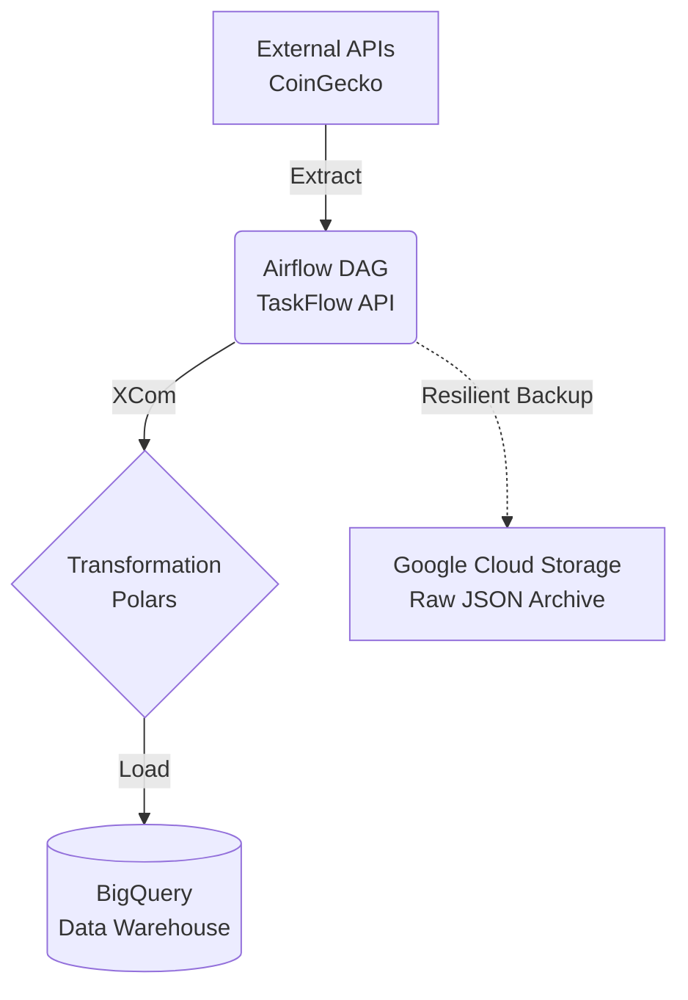

# 🪙 Crypto Analytics Platform

> **P-02** — Cryptocurrency analytics pipeline with **Polars**, **GCP BigQuery**, **Apache Airflow**, and **Terraform**.
> Status: ✅ Completed v1.0

[](https://python.org)
[](https://pola.rs)
[](https://cloud.google.com)
[](https://airflow.apache.org)
[](https://terraform.io)

---

## 📋 Description

This project is an automated, end-to-end data pipeline (ETL) built for the daily extraction, transformation, and analysis of cryptocurrency prices and indicators. It is designed with a strong focus on **resilience**, **scalability**, and **high-performance in-memory processing**.

The pipeline orchestrates daily ingestion from public APIs (such as CoinGecko), calculates technical indicators (MACD, RSI, Bollinger Bands) using **Polars**, archives an immutable backup in JSON format on **Google Cloud Storage (GCS)**, and performs the final analytical load into **Google BigQuery**.

---

## 🏗️ Architecture



> Detailed architecture, ADRs, and technical decisions: [docs/architecture.md](docs/architecture.md)

---

## 🚀 Quickstart (Local Execution)

To run this project in your local environment with unit or integration tests:

```bash
# 1. Clone the repository
git clone https://github.com/your-username/crypto-analytics-platform.git
cd crypto-analytics-platform

# 2. Create and activate the virtual environment (REQUIRED)
python3 -m venv .venv
source .venv/bin/activate

# 3. Install dependencies (including dev)
pip install -e ".[dev]"

# 4. Environment Variables
cp .env.example .env
# Edit .env and configure your GCP_PROJECT_ID and GOOGLE_APPLICATION_CREDENTIALS
```

### Running Airflow Locally
To see the Airflow UI and run the DAG manually:
```bash
airflow standalone
```
*Then open `http://localhost:8080` in your browser.*

---

## 🏆 Milestones Achieved

The project was built in 3 iterative phases using GitFlow:

1. **Phase 1: Extraction & Transformation**
   - HTTP connector for CoinGecko.
   - Robust schema validation using **Pydantic v2**.
   - Transformation engine using **Polars** for lightning-fast financial calculations.

2. **Phase 2: Data Warehouse & Orchestration**
   - Infrastructure as Code (IaC) on GCP using **Terraform**.
   - Implementation of loaders and automatic upserts to BigQuery.
   - DAG design using the modern **Apache Airflow 3.x TaskFlow API**.
   - E2E integration tests using `dag.test()`.

3. **Phase 3: Fallback Archive & Resilience**
   - Resilient `GCSLoader` for raw storage.
   - Comprehensive exception handling and Airflow logging connection (preventing DAG failures due to GCS connection errors).

---

## 📁 Project Structure

```text
crypto-analytics-platform/
├── pyproject.toml      # Dependencies and config
├── src/
│   ├── extractors/     # HTTP Connectors
│   ├── transformers/   # Polars logic
│   ├── loaders/        # GCS and BigQuery loaders
│   ├── models/         # Pydantic models
│   └── dags/           # Airflow DAGs (crypto_daily_pipeline.py)
├── tests/
│   ├── unit/           # DAG Validation, GCSLoader tests
│   └── integration/    # E2E pipeline tests
├── infra/              # Terraform scripts for GCP
└── docs/               # Architecture ADRs and issue logs
```

---

*Data/AI Engineering Portfolio — Alejandro Camerlengo*
